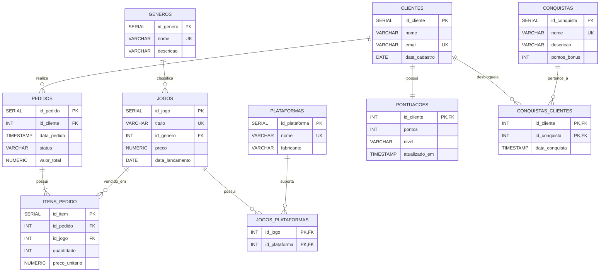

# Sistema de Jogos e Vendas de Jogos

## 1. Apresentação do projeto

### Tema

Sistema de gerenciamento de jogos e vendas de jogos digitais, com uma funcionalidade de gamificação para aumentar o engajamento dos clientes.

### Objetivo geral

Desenvolver um banco de dados relacional em PostgreSQL para controlar clientes, jogos, gêneros, plataformas e vendas. Como elemento inovador, o sistema possui um módulo de **gamificação**, permitindo que clientes acumulem pontos, evoluam de nível e desbloqueiem conquistas de acordo com suas compras.

### Público-alvo

Lojas de jogos digitais e plataformas de comércio de jogos que desejam organizar suas vendas e oferecer mecanismos de engajamento aos clientes.

---

## 2. Tecnologias utilizadas

- PostgreSQL
- SQL
- HTML5
- CSS3
- GitHub
- Mermaid

---

## 3. Funcionalidade inovadora: Gamificação

A inovação escolhida para o projeto é a **gamificação**.

A cada R$ 1,00 gasto em compras, o cliente recebe 1 ponto.

### Níveis

| Pontuação | Nível |
|---:|---|
| 0 a 99 | Novato |
| 100 a 499 | Jogador |
| 500 a 999 | Veterano |
| 1000 ou mais | Lenda |

### Conquistas

| Conquista | Regra |
|---|---|
| Primeira Compra | Realizar pelo menos uma compra |
| Colecionador | Comprar pelo menos 3 jogos diferentes |
| Grande Investidor | Gastar pelo menos R$ 500,00 |
| Lenda dos Jogos | Alcançar pelo menos 1000 pontos |

A pontuação é armazenada na tabela `pontuacoes`, enquanto as conquistas disponíveis são cadastradas em `conquistas`. A tabela `conquistas_clientes` registra quais conquistas foram desbloqueadas por cada cliente.

---

## 4. Modelo de dados relacional

### Diagrama completo

---

## 5. Relacionamentos

- Um cliente pode realizar vários pedidos.
- Cada pedido pertence a um cliente.
- Um pedido possui um ou mais itens.
- Cada item representa um jogo vendido.
- Um jogo pertence a um gênero.
- Um jogo pode estar disponível em várias plataformas.
- Uma plataforma pode possuir vários jogos.
- Um cliente possui uma pontuação de gamificação.
- Um cliente pode desbloquear várias conquistas.
- Uma conquista pode ser desbloqueada por vários clientes.
- `conquistas_clientes` representa o relacionamento muitos-para-muitos entre clientes e conquistas.

---

## 6. Jogos utilizados

| Jogo | Gênero | Preço |
|---|---|---:|
| Minecraft | Sandbox | R$ 99,90 |
| GTA V | Ação/Aventura | R$ 119,90 |
| Terraria | Sandbox | R$ 39,90 |
| Hollow Knight | Metroidvania | R$ 46,99 |
| Elden Ring | RPG | R$ 249,90 |

---

## 7. Estrutura dos scripts

### V1 - Criação das tabelas

Os scripts `V1__create_table_*.sql` criam a estrutura principal do banco.

### V2 - Inserção de dados

Os scripts `V2__insert_into_*.sql` inserem clientes, gêneros, plataformas, jogos, pedidos e relacionamentos.

### V3 - Atualização

O script `V3__update_jogos.sql` demonstra operações de `UPDATE`.

### V4 - Exclusão

O script `V4__delete_jogos.sql` demonstra operações de `DELETE` e integridade referencial.

### V5 - Gamificação

Os scripts `V5__create_table_*.sql` criam as novas tabelas da funcionalidade de gamificação.

### V6 - Dados da gamificação

O script `V6__insert_into_gamificacao.sql` insere as pontuações, níveis e conquistas de exemplo.

---

## 8. Ordem de execução

1. `V1__create_table_clientes.sql`
2. `V1__create_table_generos.sql`
3. `V1__create_table_plataformas.sql`
4. `V1__create_table_jogos.sql`
5. `V1__create_table_pedidos.sql`
6. `V1__create_table_itens_pedido.sql`
7. `V1__create_table_jogos_plataformas.sql`
8. `V2__insert_into_clientes.sql`
9. `V2__insert_into_generos.sql`
10. `V2__insert_into_plataformas.sql`
11. `V2__insert_into_jogos.sql`
12. `V2__insert_into_jogos_plataformas.sql`
13. `V2__insert_into_pedidos.sql`
14. `V2__insert_into_itens_pedido.sql`
15. `V3__update_jogos.sql`
16. `V4__delete_jogos.sql`
17. `V5__create_table_pontuacoes.sql`
18. `V5__create_table_conquistas.sql`
19. `V5__create_table_conquistas_clientes.sql`
20. `V6__insert_into_gamificacao.sql`

Os scripts de criação utilizam `CREATE TABLE IF NOT EXISTS`, permitindo execução repetida sem erro pela existência das tabelas.

---

## 9. Integridade dos dados

O banco utiliza:

- `PRIMARY KEY`;
- `FOREIGN KEY`;
- `NOT NULL`;
- `UNIQUE`;
- `CHECK`;
- `DEFAULT`;
- Integridade referencial;
- Restrições de pontuação;
- Restrições para impedir quantidade de itens menor ou igual a zero.

---

## 10. Protótipo de interface

Foi criado um protótipo simples em HTML e CSS para representar a área de gamificação do cliente.

O protótipo apresenta:

- Nome do cliente;
- Nível atual;
- Barra de progresso;
- Pontuação;
- Conquistas desbloqueadas;
- Conquistas bloqueadas;
- Jogos adquiridos.

Arquivo:

`prototipo/index.html`

O protótipo é apenas uma representação visual da funcionalidade e não possui integração com o PostgreSQL.

---

## 11. Autor

Projeto desenvolvido para atividade acadêmica de Banco de Dados.
