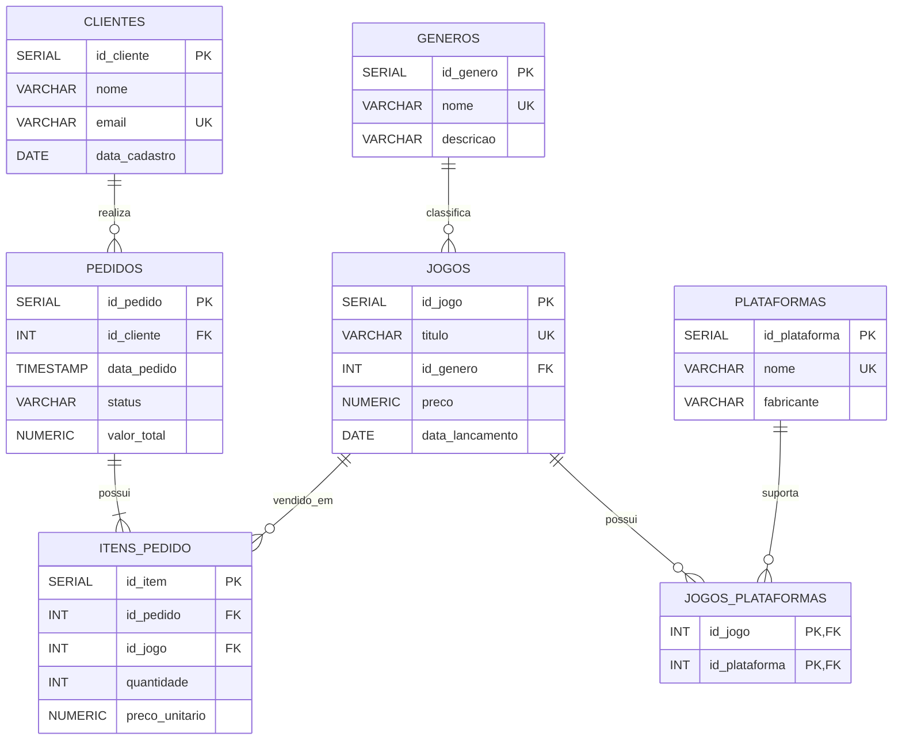

# Sistema de Jogos e Vendas de Jogos

## 1. Apresentação do projeto

### Tema

O projeto consiste em um banco de dados relacional para gerenciamento de um catálogo de jogos e das vendas realizadas por uma loja de jogos digitais.

### Objetivo geral

O objetivo é desenvolver um banco de dados em PostgreSQL capaz de armazenar e organizar informações sobre clientes, jogos, gêneros, plataformas e pedidos de compra.

O sistema permite:

- Cadastrar clientes;
- Cadastrar gêneros de jogos;
- Cadastrar plataformas;
- Cadastrar jogos e seus respectivos preços;
- Relacionar jogos com diferentes plataformas;
- Registrar pedidos realizados pelos clientes;
- Registrar os jogos presentes em cada pedido;
- Alterar informações de jogos;
- Excluir registros para validar as regras de integridade do banco.

### Público-alvo

O sistema é destinado a lojas de jogos digitais e plataformas de comércio de jogos que precisam controlar seu catálogo e registrar vendas realizadas para seus clientes.

---

## 2. Tecnologias utilizadas

- PostgreSQL
- SQL
- GitHub
- Mermaid para representação do modelo de dados

---

## 3. Modelo de dados relacional

O banco de dados possui sete tabelas principais:

- `clientes`
- `generos`
- `plataformas`
- `jogos`
- `pedidos`
- `itens_pedido`
- `jogos_plataformas`

### Diagrama

### Relacionamentos

- Um cliente pode realizar vários pedidos.
- Cada pedido pertence a um único cliente.
- Um pedido possui um ou mais itens.
- Cada item de pedido está relacionado a um jogo.
- Um jogo pertence a um gênero.
- Um jogo pode estar disponível em várias plataformas.
- Uma plataforma pode possuir vários jogos.
- A tabela `jogos_plataformas` representa o relacionamento muitos-para-muitos entre jogos e plataformas.

---

## 4. Jogos utilizados nos dados de exemplo

Os seguintes jogos foram utilizados para popular o banco:

| Jogo | Gênero | Preço |
|---|---|---:|
| Minecraft | Sandbox | R$ 99,90 |
| GTA V | Ação/Aventura | R$ 119,90 |
| Terraria | Sandbox | R$ 39,90 |
| Hollow Knight | Metroidvania | R$ 46,99 |
| Elden Ring | RPG | R$ 249,90 |

---

## 5. Estrutura dos scripts

Os scripts estão organizados na pasta `scripts/`.

### Versão 1 - Estrutura do banco

Os arquivos `V1__create_table_*.sql` criam as tabelas do banco de dados.

### Versão 2 - Dados iniciais

Os arquivos `V2__insert_into_*.sql` inserem dados de exemplo para testar os relacionamentos.

### Versão 3 - Atualização

O arquivo `V3__update_jogos.sql` realiza alterações nos dados dos jogos.

### Versão 4 - Exclusão

O arquivo `V4__delete_jogos.sql` demonstra a exclusão de um registro e a proteção por chave estrangeira.

---

## 6. Ordem de execução

Execute os scripts na seguinte ordem:

1. `V1__create_table_clientes.sql`
2. `V1__create_table_generos.sql`
3. `V1__create_table_plataformas.sql`
4. `V1__create_table_jogos.sql`
5. `V1__create_table_pedidos.sql`
6. `V1__create_table_itens_pedido.sql`
7. `V1__create_table_jogos_plataformas.sql`
8. `V2__insert_into_clientes.sql`
9. `V2__insert_into_generos.sql`
10. `V2__insert_into_plataformas.sql`
11. `V2__insert_into_jogos.sql`
12. `V2__insert_into_jogos_plataformas.sql`
13. `V2__insert_into_pedidos.sql`
14. `V2__insert_into_itens_pedido.sql`
15. `V3__update_jogos.sql`
16. `V4__delete_jogos.sql`

Os scripts de criação utilizam `CREATE TABLE IF NOT EXISTS`, permitindo que sejam executados novamente sem causar erro pela existência das tabelas.

Os scripts de inserção utilizam `ON CONFLICT DO NOTHING` quando aplicável, permitindo sua execução repetida sem duplicar registros que possuam restrições `UNIQUE`.

---

## 7. Integridade dos dados

O projeto utiliza:

- Chaves primárias (`PRIMARY KEY`);
- Chaves estrangeiras (`FOREIGN KEY`);
- Campos obrigatórios (`NOT NULL`);
- Valores únicos (`UNIQUE`);
- Restrições de domínio (`CHECK`);
- Valores padrão (`DEFAULT`);
- Restrição de quantidade positiva;
- Restrição de preço não negativo;
- Integridade referencial entre pedidos, clientes e jogos.

---

## 8. Validação

Os scripts de DML foram criados para permitir testes de:

- Inserção de registros;
- Relacionamento entre tabelas;
- Atualização de preços;
- Exclusão de registros;
- Proteção de registros relacionados por chaves estrangeiras.

O banco foi planejado para demonstrar, de forma prática, os principais conceitos de DDL e DML solicitados na atividade.

---

## 9. Autor

Projeto desenvolvido para atividade acadêmica de Banco de Dados.
